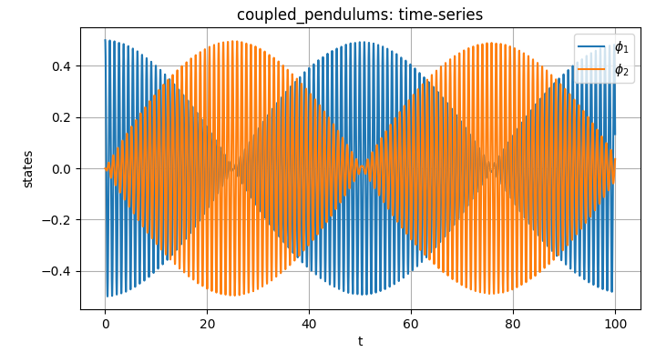

# ODEs-and-solvers-in-Python

This repository is a Python learning project focusing on simulating systems of ordinary differential equations (ODEs) using hand-written numerical solvers and a modular model interface. It is the Python twin of the original MATLAB project [ODEs-and-solvers](https://github.com/nonlinear-vibes/ODEs-and-solvers).

## Contents:
`solvers.py`:

- `ee` — Explicit (forward) Euler

- `heun` - Improved Euler (Heun)

- `ie` — Implicit (backward) Euler

- `trap` — Implicit trapezoidal rule (Crank–Nicolson)

- `rk4` — Classic 4th-order Runge–Kutta

- `rk45` — Runge–Kutta–Fehlberg 4(5) with adaptive steps

- `newton_it` — Newton-Rhapson iteration for implicit methods
  
- `num_jacobian` — Numerical Jacobian for the Newton-Rhapson iteration

All solvers share the same `solve(f, (t0, tf), y0, h) -> (t, Y)` signature.

`models.py`:

- `vdp` — van der Pol oscillator

- `lv` — Lotka–Volterra predator–prey model

- `rayleigh` — Rayleigh oscillator

- `cr3bp` — Planar circular restricted three-body problem (Earth–Moon parameters)

- `coupled_pendulums` — Coupled pendulums on a cart with damping, exhibiting spontaneous synchronization

- `sir` — Simple Susceptible-Infected-Recovered compartmental epidemic model

Each model implements `f(t: float, y: ndarray) -> ndarray`, parameters can be overridden via `params = dict(...)` in `main.py`.

## Quik Start
 - Clone this repo.
 - Run `pip install numpy matplotlib`.
 - Run `main.py`, select system, solver and simulation settings at the top of the `main()` funtion.

## Contributing
This project was meant as a learning playground, but improvements, bug fixes, and new systems/solvers are welcome.

## License
MIT License: feel free to use it for education, research, and fun.
